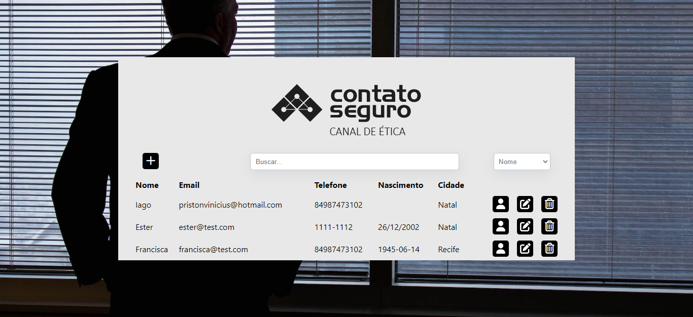

# Teste backend Contato Seguro

## Site desenvolvido para um teste técnico da Contato Seguro. Ele lista usuários com seus dados e permite criar, editar e excluir eles. Além disso é possivel ver todas as empresas vinculadas a um usuário.

<br>

<div align="center"></div>

<br>

<h4 align="center"> 
	🚧  Em construção...  🚧
</h4>

### Features

- [x] Cadastro de usuário
- [x] Cadastro da empresa
- [x] Mostrar usuários
- [x] Mostrar empresas vinculadas ao usuário
- [x] Edição do usuário
- [ ] Edição da empresa
- [x] Remoção do usuário
- [ ] Remoção da empresa

<br>

### Pré-requisitos

Antes de começar, você vai precisar ter instalado em sua máquina as seguintes ferramentas:
[Git](https://git-scm.com), [Node.js](https://nodejs.org/en/).
Além disto é bom ter um editor para trabalhar com o código como [VSCode](https://code.visualstudio.com/)

<br>

### 🎲 Rodando o Back End (servidor)

```bash
# Clone este repositório
$ git clone https://github.com/Iago-pixel/teste-front-end-contato-seguro.git

# Acesse a pasta do projeto no terminal/cmd
$ cd teste-front-end-contato-seguro

# Instale as dependências
$ npm install

# Execute a aplicação em modo de desenvolvimento
$ npm start

# O servidor inciará na porta:3000 - acesse http://localhost:3000
```

<br>

### 🛠 Tecnologias

As seguintes ferramentas foram usadas na construção do projeto:

[](https://www.npmjs.com/)
[](https://nodejs.org/en)
[](https://react.dev/)
[](https://redux.js.org/)
[](https://developer.mozilla.org/pt-BR/docs/Web/HTML)
[](https://developer.mozilla.org/pt-BR/docs/Web/CSS)
[](https://developer.mozilla.org/pt-BR/docs/Web/JavaScript)

<br>


<br />
<sub><b>Iago Vinícius</b></sub>

Feito com ❤️ por Iago Vinícius 👋🏽 Entre em contato!

[](https://www.linkedin.com/in/iago-vinicius-souza/)

[](mailto:pristonvinicius@hotmail.com)
